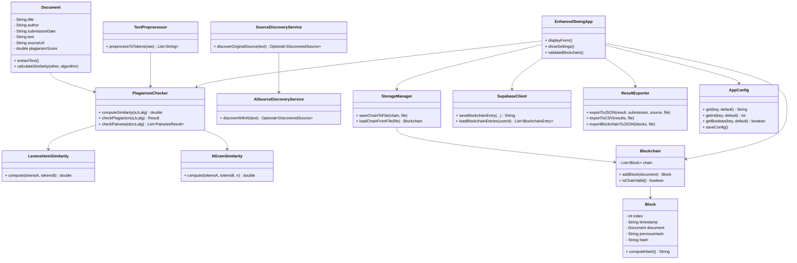
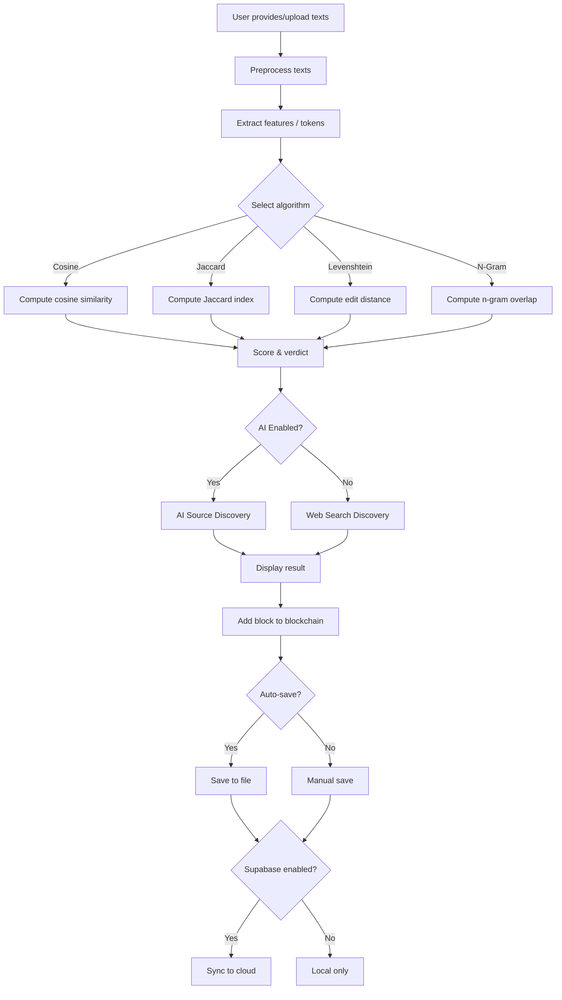

# Advanced Plagiarism Detection System v2.0

A comprehensive desktop application built with Java Swing that provides advanced plagiarism detection using multiple algorithms, AI-powered source discovery, blockchain-based tamper-proof storage, and cloud synchronization with Supabase.

## Key Features

- **Multiple Similarity Algorithms**: Cosine, Jaccard, Levenshtein Distance, N-Gram
- **AI-Powered Source Discovery**: Integrates with OpenAI/Anthropic for intelligent source finding
- **Blockchain Storage**: Tamper-evident blockchain for audit trails
- **Cloud Sync**: Optional Supabase integration for cloud storage
- **Export Options**: JSON, CSV, and detailed text reports
- **Modern UI**: Enhanced Swing interface with progress tracking and visualization
- **Configurable**: Customizable thresholds and settings

## Requirements

- Java 11+ (tested on Java 17 and Java 21)
- Optional: OpenAI or Anthropic API key for AI-powered source discovery
- Optional: Supabase account for cloud synchronization

## Quick Start

### Compile and Run

```bash
# Compile all sources
find src -name "*.java" > sources.list
javac -d out @sources.list

# Package runnable JAR (Original UI)
mkdir -p out_jar
jar --create --file out_jar/plagiarism-app.jar --main-class com.example.plagiarism.SwingApp -C out .

# Or package with Enhanced UI
jar --create --file out_jar/plagiarism-app-enhanced.jar --main-class com.example.plagiarism.ui.EnhancedSwingApp -C out .

# Run Original UI
java -jar out_jar/plagiarism-app.jar

# Run Enhanced UI (Recommended)
java -jar out_jar/plagiarism-app-enhanced.jar
```

### Configuration

On first run, a configuration file is created at `~/.plagiarism_checker_config.properties`

Optionally set environment variables for AI and cloud features:

```bash
export ANTHROPIC_API_KEY="your-api-key"
# or
export OPENAI_API_KEY="your-api-key"

# For Supabase integration
export VITE_SUPABASE_URL="your-supabase-url"
export VITE_SUPABASE_ANON_KEY="your-supabase-key"
```

**Headless Mode**: The application automatically detects headless environments and falls back to console mode with basic source discovery functionality.

## Feature Details

### Text Preprocessing
- Lowercase normalization
- Punctuation and number removal
- English stopword filtering
- Token deduplication
- Sentence extraction

### Similarity Algorithms

1. **Cosine Similarity**: Vector-based similarity using TF frequency
2. **Jaccard Index**: Set-based intersection over union
3. **Levenshtein Distance**: Edit distance normalized similarity
4. **N-Gram Similarity**: Token sequence overlap (default: trigrams)

### Verdict System

- **Safe**: < 30% similarity (configurable)
- **Moderate**: 30-70% similarity (configurable)
- **High**: > 70% similarity (configurable)

### AI Source Discovery

- Analyzes submission text to generate intelligent search queries
- Supports both Anthropic Claude and OpenAI GPT models
- Falls back to traditional web search if AI unavailable
- Scrapes and compares candidate sources automatically

### Blockchain Features

- Each plagiarism check creates an immutable block
- SHA-256 hashing for integrity
- Chain validation to detect tampering
- Stores full document metadata and source information
- Local file storage with optional cloud backup

### Export Capabilities

- **JSON**: Structured data export for results and blockchain
- **CSV**: Spreadsheet-compatible batch results
- **Text Reports**: Detailed human-readable analysis reports

## Project Structure

```
src/com/example/plagiarism/
├── Core Components
│   ├── Document.java                    # Document entity
│   ├── TextPreprocessor.java           # Text cleaning/tokenization
│   ├── PlagiarismChecker.java          # Main orchestration
│   ├── Block.java & Blockchain.java    # Blockchain implementation
│   └── StorageManager.java             # File persistence
│
├── Similarity Algorithms
│   ├── similarity/
│   │   ├── LevenshteinSimilarity.java
│   │   └── NGramSimilarity.java
│
├── AI Integration
│   ├── ai/
│   │   └── AISourceDiscoveryService.java
│   └── SourceDiscoveryService.java     # Web source discovery
│
├── Cloud Integration
│   └── supabase/
│       └── SupabaseClient.java         # Cloud sync
│
├── Export & Reporting
│   └── export/
│       └── ResultExporter.java         # JSON/CSV/Report export
│
├── Configuration
│   └── config/
│       └── AppConfig.java              # Settings management
│
└── User Interface
    ├── ui/
    │   ├── EnhancedSwingApp.java       # Modern Swing UI
    │   └── SettingsDialog.java         # Configuration UI
    ├── SwingApp.java                   # Original UI
    └── ConsoleMain.java                # Headless fallback
```

## Usage Guide

### Basic Workflow

1. **Launch the Application**
   - Run the JAR file or use the main class
   - Enhanced UI recommended for full features

2. **Load Documents**
   - Type/paste text directly into text areas
   - Upload text files (.txt, .md)
   - Use clipboard paste functionality

3. **Select Algorithm**
   - Choose from Cosine, Jaccard, Levenshtein, or N-Gram
   - Different algorithms suit different use cases

4. **Run Analysis**
   - **Manual Check**: Compare two loaded documents
   - **Auto-Discovery**: Let AI find the original source

5. **View Results**
   - Similarity percentage and color-coded verdict
   - Source URL if discovered automatically
   - Results stored in blockchain history

6. **Export and Save**
   - Export blockchain to JSON
   - Generate CSV reports
   - Create detailed text reports

### Advanced Features

#### Settings Configuration

Access via Tools → Settings:

- Adjust similarity thresholds
- Enable/disable AI source discovery
- Choose AI model (Anthropic/OpenAI)
- Configure auto-save behavior
- Set source discovery parameters

#### Blockchain Validation

- Tools → Validate Blockchain
- Checks entire chain for tampering
- Verifies all block hashes

#### Cloud Synchronization

- Requires Supabase configuration
- Automatically backs up blockchain entries
- Enables multi-device access to history

## Notes

- Storage format is a simple pipe-delimited text for clarity. JSON export also available.
- For multi-document pairwise similarity, see `PlagiarismChecker.checkPairwise`.

## Future Enhancements

- Semantic similarity using embeddings
- Batch document processing
- Citation extraction and analysis
- PDF document support
- Real-time collaboration features
- Advanced visualization dashboards

## Architecture Diagrams





## License

This project is open-source and available for educational and research purposes.
