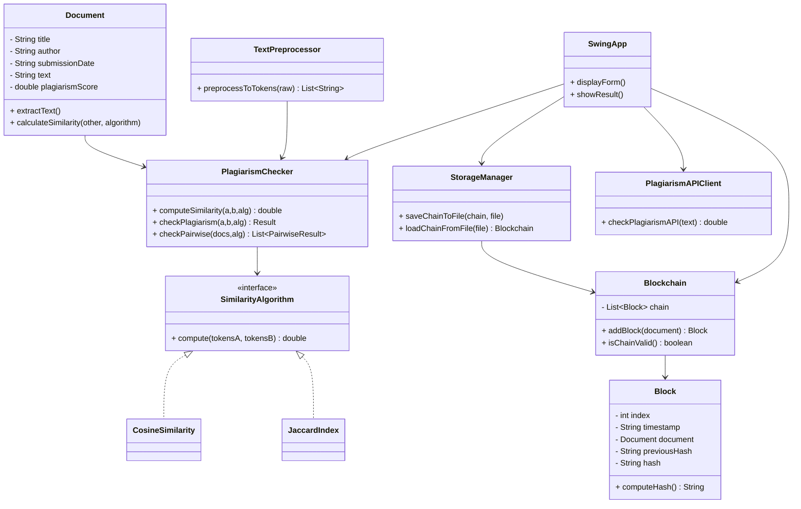
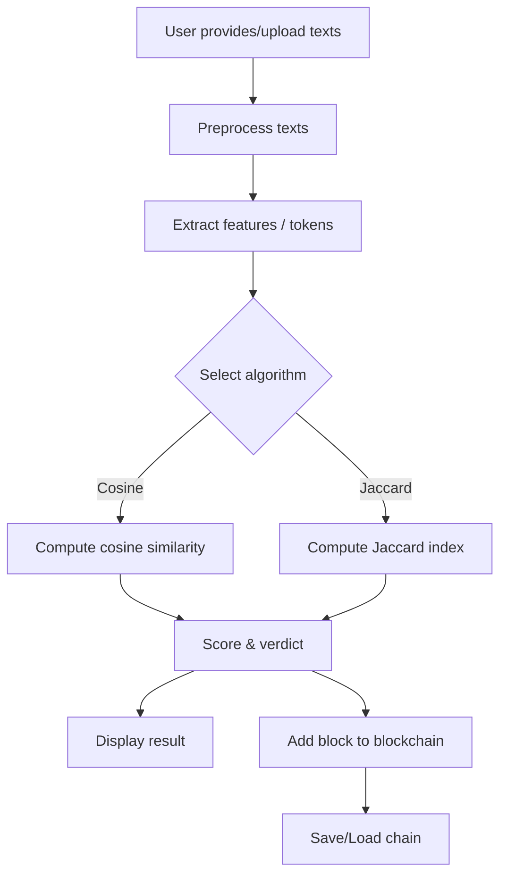

# Plagiarism Detection System (Java + Swing + Blockchain)

A desktop Swing app that preprocesses documents, computes similarity (Cosine/Jaccard), and writes tamper-evident results to a simple blockchain stored on disk.

## Requirements
- Java 11+ (tested on Java 21)

## Run
```bash
# Compile
find src -name "*.java" > sources.list
javac -d out @sources.list

# Package runnable JAR
mkdir -p out_jar
jar --create --file out_jar/plagiarism-app.jar --main-class com.example.plagiarism.SwingApp -C out .

# Run
java -jar out_jar/plagiarism-app.jar
```

If running on a headless server (no GUI), the app will automatically fall back to a console demo that prints a sample similarity and writes the blockchain file to `~/plagiarism_chain.txt`.

## Features
- Preprocessing: lowercase, remove punctuation/numbers, stopword removal, deduplicate tokens
- Similarity: Cosine Similarity and Jaccard Index
- Verdicts: Safe (<30%), Moderate (30–70%), High (>70%)
- Blockchain: each check adds a block with document metadata and score; supports save/load and validation
- Mock external API: optional pseudo-random score for a document

## Structure
- `com.example.plagiarism.Document` – document entity
- `com.example.plagiarism.TextPreprocessor` – text cleaning/tokenization
- `com.example.plagiarism.SimilarityAlgorithm` (+ `CosineSimilarity`, `JaccardIndex`)
- `com.example.plagiarism.PlagiarismChecker` – orchestration & verdicts
- `com.example.plagiarism.Block`, `Blockchain` – minimal blockchain
- `com.example.plagiarism.StorageManager` – save/load chain to text file
- `com.example.plagiarism.PlagiarismAPIClient` – mock API client
- `com.example.plagiarism.WebSearchClient` – exact-phrase web search (DDG/Bing HTML)
- `com.example.plagiarism.SwingApp` – GUI

## Notes
- Storage format is a simple pipe-delimited text for clarity. JSON can be added later.
- For multi-document pairwise similarity, see `PlagiarismChecker.checkPairwise`.

## Future Enhancements
- Export results to JSON/CSV
- Add n-gram/token weighting
- Integrate real plagiarism APIs
- Improve blockchain persistence and document content hashing
 - Add configurable search providers/APIs (Google Custom Search, SerpAPI)

## Exact-phrase web search
The UI offers a "Find Sources (Exact Doc1)" button that searches the web for pages containing exact phrases quoted from Document 1. It currently uses DuckDuckGo (HTML) with a Bing HTML fallback. Results open in your default browser.

## Architecture Diagrams




